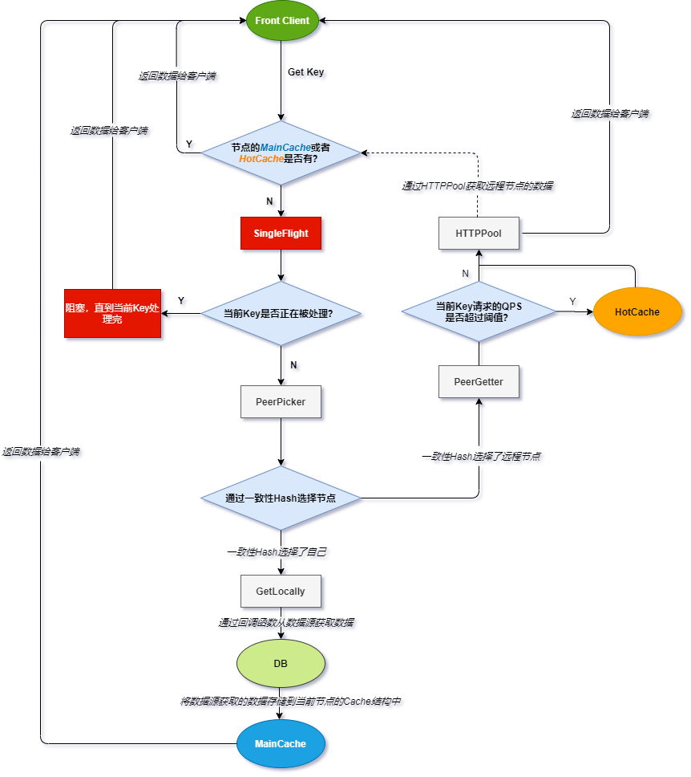
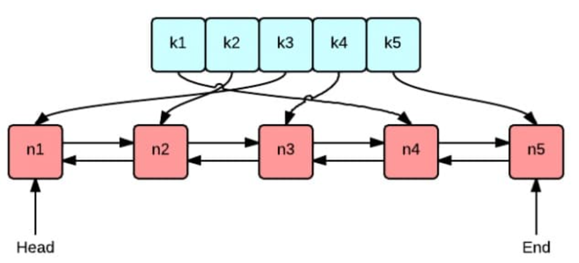

# GeeCache

A [groupcache](https://github.com/golang/groupcache)-like distributed cache

## 技术点总结

最主要的技术点：**一致性哈希防止缓存雪崩、分布式节点、WaitGroup防止缓存击穿**

- 基于最近最少访问(Least Recently Used, LRU) 的缓存策略

- 实现单机并发缓存，并设计 HTTP 服务端和客户端实现分布式缓存
- 实现一致性哈希算法，用以解决因节点数量变化引起的缓存雪崩问题
- 使用 Go 的 WaitGroup 机制防止因大量重复请求导致缓存击穿

### 整体流程

（图片来自 [imlgw](https://github.com/imlgw/gacache)）



### LRU：哈希map+双向链表



- 哈希表是 `map[string]*list.Element` 类型，双向链表是`*list.List`类型
- 每插入一个数据，就调用list.MoveToFront(elem)放到链表头
- 每从链表尾删除一个数据之后，就对该数据调用 `OnEvicted()` 回调函数

### Cache

- Cache是对LRU的实例化，并封装get和add

- **最顶层是Group**，每种不同的Group代表不同种类的数据

- Group记录了：Cache类名、该种cache的getter函数、cache主体、PeerPicker

- ```go
  type Group struct {
  	name      string
  	getter    Getter // 用户定义的从db获取数组的方法
  	mainCache cache
  	peers     PeerPicker // 实际上是代码里定义的*HTTPPool，见下
  	loader    *singleflight.Group
  }
  
  type HTTPPool struct {
  	self     string
  	basePath string				 // "/_geecache/"
  	mu       sync.Mutex          // guards peers and httpGetters
  	peers    *consistenthash.Map // 一致性哈希算法，根据具体的 key 选择节点。
      httpGetters map[string]*httpGetter // 如 http://localhost:8001 --> http://localhost:8001/_geecache/
  }
  ```

### 取数据流程

1. 先用下列脚本开启三个节点，每个节点都有一套独立的Group等，因此就有独立的PeerGetter和PeerPicker等。

   ```shell
   go build -o server
   ./server -port=8001 &
   ./server -port=8002 &
   ./server -port=8003 -api=1 &`
   ```

2. 取数据的话，先由最顶层的group调用g.Get(key)，试图从mainCache取key对应的数据，如果数据不在mainCache中，则调用load

   ```go
   func (g *Group) Get(key string) (ByteView, error) {
   	if key == "" {
   		return ByteView{}, fmt.Errorf("key is required")
   	}
   
   	if v, ok := g.mainCache.get(key); ok {
   		log.Println("[GeeCache] hit")
   		return v, nil
   	}
   
   	return g.load(key)
   }
   ```

3. 在load中：

   1. 先调用(PeerPicker).PickPeer(key)尝试找到数据在哪个节点上peer，再调用g.getFromPeer(peer, key)从该节点获取数据。peer是PeerGetter类型。PeerPicker实际上是*HTTPPool。
   2. 若没有相应节点，则调用g.getLocally(key)直接从本节点获取数据，一般是从db中获取，并由populateCache(key, cache)将数据提到mainCache上

   ```go
   func (g *Group) load(key string) (value ByteView, err error) {
   	viewi, err := g.loader.Do(key, func() (interface{}, error) {
   		if g.peers != nil {
   			if peer, ok := g.peers.PickPeer(key); ok {
   				if value, err = g.getFromPeer(peer, key); err == nil {
   					return value, nil
   				}
   				log.Println("[GeeCache] Failed to get from peer", err)
   			}
   		}
   
   		return g.getLocally(key)
   	})
   
   	if err == nil {
   		return viewi.(ByteView), nil
   	}
   	return
   }
   ```
   3. - getFromPeer()里调用的是(httpGetter).Get(group, key)。逻辑是构造url，利用目标节点的ServeHTTP监听分解该url，再次调用该目标节点的g.Get(key)，这样调用的一定是目标节点的getLocally()，并由populateCache(key, cache)将数据从db提到mainCache上。
      
      - getLocally()里调用的是(Getter).Get(key)。逻辑是用户自定义的函数，一般直接从db中取值
      
        ```go
        func (h *httpGetter) Get(group string, key string) ([]byte, error) {
        	u := fmt.Sprintf(
        		"%v%v/%v",
        		h.baseURL,
        		url.QueryEscape(group),
        		url.QueryEscape(key),
        	)
        	fmt.Println("u: ", u) 	// u: score/Tom
        	res, err := http.Get(u) // 调用go标准库函数Get，获取远程节点上的数据
        
        	defer res.Body.Close()
        	if res.StatusCode != http.StatusOK {
        		return nil, fmt.Errorf("server returned: %v", res.Status)
        	}
        	bytes, err := ioutil.ReadAll(res.Body)
        	if err != nil {
        		return nil, fmt.Errorf("reading response body: %v", err)
        	}
        	fmt.Println("bytes: ", bytes)
        	return bytes, nil
        }
        
        func (p *HTTPPool) ServeHTTP(w http.ResponseWriter, r *http.Request) {
            // ... 
            // 分解request中的URL，得到group和key
        	group := GetGroup(groupName)
        	view, err := group.Get(key)
        	w.Header().Set("Content-Type", "application/octet-stream")
        	w.Write(view.ByteSlice())
        }
        ```


### 一致性哈希

- 一致性哈希解决因节点数量变化引起的缓存雪崩问题
- 若不使用一致性哈希：假设10个节点移除一个剩下 9 个，那么之前 `hash(key) % 10` 变成了 `hash(key) % 9`，也就意味着几乎缓存值对应的节点都发生了改变。即几乎所有的缓存值都失效了。节点在接收到对应的请求时，均需要重新去数据源获取数据，容易引起 `缓存雪崩`
- **缓存雪崩**：缓存里的数据大批量到期，造成瞬时DB请求量过大、压力骤增，引起雪崩。常因为缓存服务器宕机，或缓存设置了相同的过期时间引起的。
- **为了解决数据倾斜问题，将真实节点增殖为虚拟节点，并记录真实节点和虚拟节点的对应关系**
- **Add**：加入**虚拟节点**，虚拟节点以 i + node名 为hash的key
- **Get**：以输入的key作为hash key
  - 搜索 `( 0，len(虚拟节点数) ]`里第一个满足 `hashvalue[i] >= keyhashvalue`的 `i`
  
  - 返回该虚拟节点对应的真实节点，接下来就从该真实节点获取数据
  
  - ```go
    func (m *Map) Get(key string) string {
    	if len(m.virtualNodes) == 0 {
    		return ""
    	}
    
    	hashValue := int(m.hash([]byte(key)))
    	// Binary search for approriate replica
    	idx := sort.Search(len(m.virtualNodes), func(i int) bool {
    		return m.virtualNodes[i] >= hashValue
    	})
        
    	// return the real key
    	return m.hashMap[m.virtualNodes[idx%len(m.virtualNodes)]]
    }
    ```

### PeerPicker & PeerGetter

- 设定其中一个节点是**前台api节点**用于接待和转发用户请求

- **PeerPicker：**是HTTPPool，定义见上。

- **PeerGetter：**本质上就只是个url如`http://localhost:8001/_geecache/`。对于某个节点而言，其它的节点都是PeerGetter，同样可见上方HTTPPool的定义。

- 每个节点都有独立的Group，内含PeerPicker和PeerGetter。

-  每个节点都有HTTPPool (PeerPicker)，HTTPPool在初始化时将所有addr都添加到里面

- **PeerPicker如何取得正确的PeerGetter？**

  由传入的key搜索一致性哈希，若该peer不是PeerPicker，则返回该httpGetter（httpGetter是一个PeerGetter，因为它实现了`Get()`函数）

- **PeerGetter如何取得缓存值？**

  由传入的URL调用http.Get得到另一个http地址u，通过`http.Get(u)`调用`ServeHTTP`，再调用`load`

### WaitGroup防止缓存击穿

- **缓存击穿**：一个存在的key，数据库中有该数据，但缓存中没有该数据，于是大量相同的请求瞬间击穿到DB
- 使用了WaitGroup，若当前节点正在被处理，则`(WaitGroup).Wait()`否则调用`(WaitGroup).Add()`，获取节点，完成后调用`(WaitGroup).Done()`


#### Q1. GeeCache如何实现一致性？

**=>**

- 在**单机**上，定义只读的cache数据结构ByteView，使用sync.Mutex互斥锁将某一时刻的cache状态保存下来返回给用户。（由于该数据结构是只读的，用户不能直接更改cache值。所以用户要想对缓存值进行增加必须在服务器端main函数里用全局变量注册。）
- 在**不同机器**上，使用WaitGroup防止同一时间对同一个资源进行多个请求
- 使用的都是一样的哈希函数。
- **节点数量变化时，重新哈希变化的节点上的存储哈希值**
- 事实上GeeCache项目初衷是书写go的1000 stars的著名开源项目groupcache的简易版，groupcache在设计伊始就设定**数据库在初始化之后只淘汰不更新，也没有超时淘汰机制**，这样取舍简化了设计。我们的GeeCache保留了这样的设计，所以不存在同时读和同时写的状态，也就没有保证一致性的需求。

#### Q2. GeeCache如何初始化缓存里的key-value？

**=>** 

在main中，设置全局变量db，一个map，表示数据库。在`createGroup()`中设置Getter取值函数，该函数从db中取值。

```go
func createGroup() *geecache.Group {
	return geecache.NewGroup("scores", 2<<10, geecache.GetterFunc(
		func(key string) ([]byte, error) {
			log.Println("[SlowDB] search key", key)
			if v, ok := db[key]; ok {
				return []byte(v), nil
			}
			return nil, fmt.Errorf("%s not exist", key)
		}))
}
```

#### Q3. 还有其他解决缓存雪崩、缓存击穿、缓存穿透的方法吗？

**=>**

- **缓存雪崩**：

  - 事前：使用高可用的缓存
  - 事中：限流降级
  - 事后：Redis数据备份，快速缓存预热。开启持久化机制，尽快恢复缓存数据

- **缓存击穿**：

  - 使用互斥锁
  - 或者设置这些热点数据永远不会过期

- **缓存穿透**：

  - 通过用户认证、参数验证等，在上层拦截这些不合理的请求

  - **缓存空值**：缓存穿透是因为查询了不存在的key导致的，那可以插入一个key，但将该值设置为null，这样就可以放入缓存中

  - **BloomFilter布隆过滤器**：在缓存之前加一层布隆过滤器，查询key有没有可能存在。

    > 布隆过滤器，即一个m位bit的位向量，多个hash函数对key进行哈希，并将相应的位设置为1。查询时，也对这个key进行多个哈希，若位向量的这些位置都为1，则该key可能存在，否则若有一位不为1，那么该key必不存在。

#### Q4. 如果设计是可以有多个api节点，此时由于增删节点即节点数量变化，api节点寻找key时找到了错误的节点上，如何解决？

#### Q5. 一致性哈希在实际生产环境or工具中的应用？